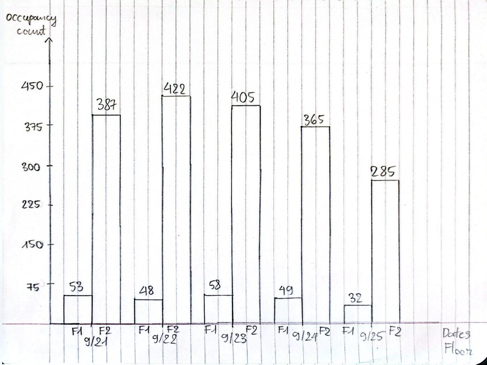
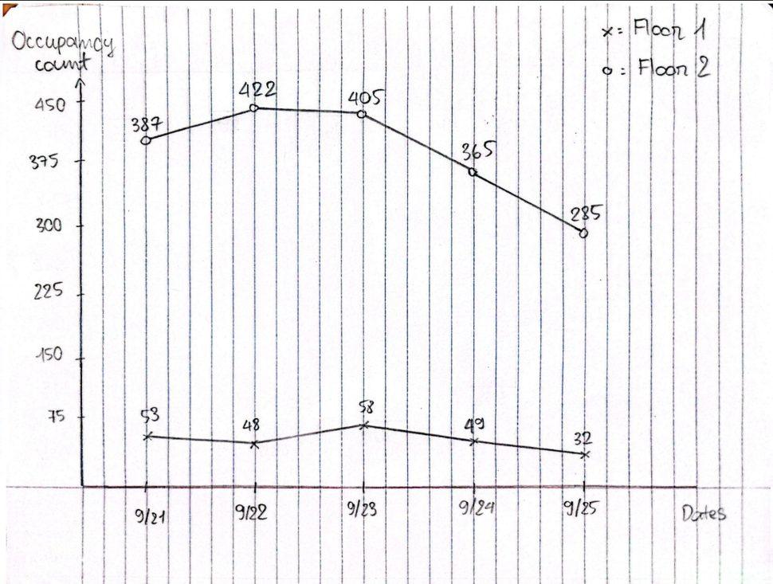
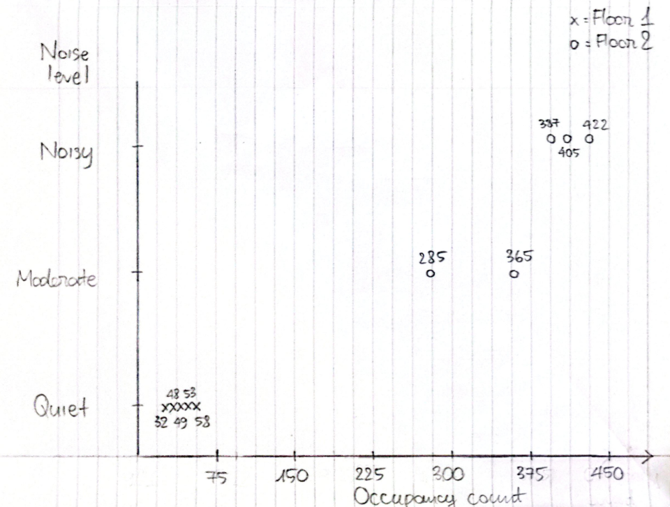
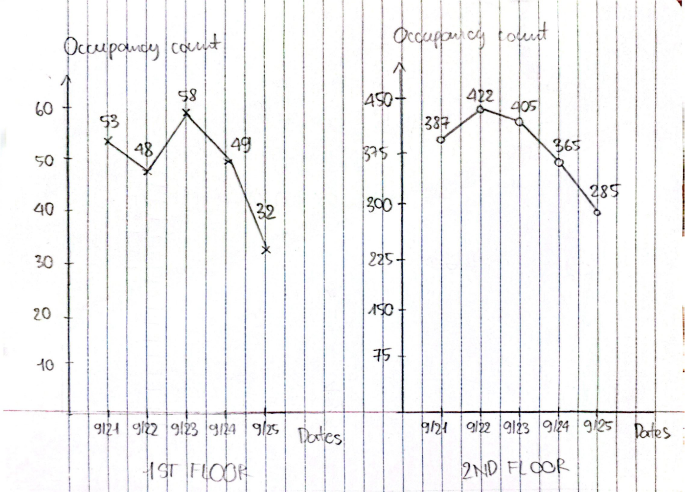
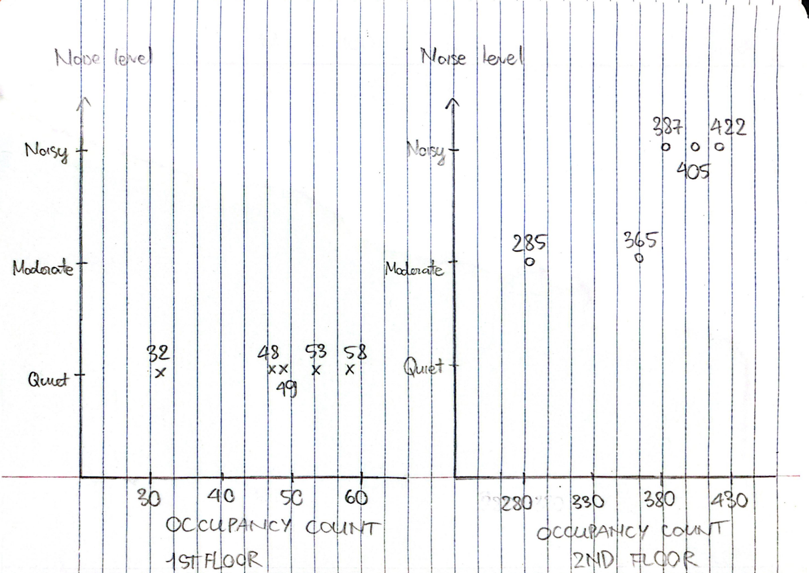

# CS 424 Assignment 1

## Task 1: Observation and Data Collection
- I chose to observe the occupancy of Richard J. Daley Library because I have been there many times and interested in how the occupancy of the two main public floors changes from Monday to Friday. The project focuses on public areas of the first and second floors and excludes private rooms. Observations were made at approximately 4 pm to ensure consistent collection from Monday to Friday.
- One observation represents one manual occupancy count of one floor. For each observation, I recorded the date, time, approximate occupancy count by my method, estimated noise level based on my hearing, and the optional notes when my counting accuracy was affected by high movement. Because this project was done by me alone, all observations were collected by me using the same general procedure.
- The collection provides the variation across location, date, and observations collected from Mondays to Fridays. I know the design has many limitations: the private room is inaccessible, and observations were made only at approximately 4 pm because that is the only time I don't have any classes throughout the week. Therefore, the data doesn't represent library occupancy for the entire day. My manual counting process may also miss or double-count occupants who enter, leave, or move. In addition, the noise level measurement is based on my personal feeling rather than an objective sound measurement.

 
## Initial Question
1. Which floor has greater occupancy at 4 pm (first or second)? 
2. How does the occupancy of each floor change throughout the week?
3. Do noise level and occupancy have a relation or not?
4. Are there any days with exceptionally high or low occupancy? 

| Attribute | Type | Description | Example |
|---|---|---|---|
|date|Temporal|Date of observation|9/21/2026|
|time|Temporal|Time of observation|4 pm|
|floor|Categorical|Observed library floor|first|
|occupancy_count|Quantitative|Approximate number of occupants|53|
|noise_level|Ordinal|Noise level of the floor|Quiet|
|notes|Text|Optional notes|High movement|

## Task 2: Pilot and Data Collection

### Pilot collection
- From Monday 9/21 to Friday 9/25, each day I collected two pilot observations, one for each floor. In each observation, I counted the total number of occupants in the floor's public area. To make this task easier, I counted the number of fully occupied 4-seat tables and the number of individuals, and then calculated the total number of occupants. Because some people moved while I was counting, the occupancy result should be treated as approximate only. 

### Pilot reflection and revisions
- While the small area makes the first floor very easy to count, the second floor was more complicated than I expected because the public area is much larger and more crowded. Sometimes the noise distracted me when I was counting. 
- To improve the consistency, I divided the second floor into small sections and applied this method to all the second floor's observations. This made the process more manageable, even though I knew that an error could occur because some occupants were moving between sections. 
- The noise_level attribute was difficult to estimate consistently. To make it more systematic, I defined 3 ordered levels: Quiet < Moderate < Noisy.

## Task 3: Data description and Domain questions

### Dataset description
- The final library dataset is based on 10 observations from 9/21 to 9/25 on the public section of the UIC Richard J. Daley Library’s first and second floors around 4 pm. This dataset contains the date, time, floor, estimated number of occupants, noise level, and notes.
- All information is recorded at 4 pm each collection and does not include other times or other areas. Manual counting may miss or double-count people who do not stay in one position during the observation. 

### Reflection on the Data
- Each observation represents one floor at one collection time, with the number of people present recorded as one approximate occupancy value. The data that is collected contains no more information than when and where an observation takes place, how many people were there, and at what noise level the floor was. However, it says nothing about who these people are (students, TAs, professors, or staff), what they do there, or how long they stay.

### Final domain questions
1. What is the occupancy disparity on each day between two floors? 
2. Is there a similar pattern between the occupancy of two floors?
3. Is there a relation between the noise level and occupancy level for each floor?
4. Which days record the highest and lowest occupancies?

## Task 4: Task abstractions
| Domain question | Task Abstraction |
|---|---|
| **1** | **Action:** Compare occupancy values between the first and second floors. **Target:** `occupancy_count` by `floor` and `date`. **Abstract task:** Compare quantitative values across categories and dates. |
| **2** | **Action:** Compare occupancy patterns across five days. **Target:** `occupancy_count` over `date`, grouped by `floor`. **Abstract task:** Compare temporal patterns across categories. |
| **3** | **Action:** Examine the relationship between occupancy and noise level. **Target:** `occupancy_count` and `noise_level`, grouped by `floor`. **Abstract task:** Examine the relationship between a quantitative and an ordinal attribute. |
| **4** | **Action:** Find the highest and lowest occupancy values. **Target:** `occupancy_count` by `date`. **Abstract task:** Find extrema across temporal categories. |
- The first and second tasks compare the occupancy and pattern between two floors. The third task examines the relationship between occupancy and noise level. The final task is to find the maximum and minimum occupancy values for each floor. These task abstractions separate the analytical goals from the visualization designs.

## Task 5: Visualization Sketches

### Sketch 01

- Sketch 01 compares occupancy between two floors across the five days. Three attributes are date, floor, and occupancy_count. Marks are bars, height representing occupancy, and horizontal position representing date and floor. This design makes it easy to compare the two floors but hard to show patterns across the five days.

### Sketch 02

- Sketch 02 compares the occupancy patterns of two floors across the five days. Three attributes are date, floor, and occupancy_count. Marks are points and lines, which show how occupancy changes over time. This design makes the temporal patterns of both floors easy to follow. However, the observations of the first floor are clustered due to the large difference in occupancy scales between the first and second floors. 

### Sketch 03

- Sketch 03 examines the relationship between occupancy and noise level. Three attributes are floor, occupancy_count, and noise_level. Marks are points that represent the relationship between occupancy and noise level. This design makes the relationship easier to inspect, but the exact occupancy difference between the two floors on each day is less direct than in Sketch 01.

### Refined 01

- This sketch is an improved version of sketch 02, separating the two floors into different charts. Three attributes still used are date, floor, and occupancy_count. Marks are points and lines, which show how occupancy changes over time. The separation makes the occupancy pattern of each floor easier to see. 

### Refined 02

- This sketch is an improved version of sketch 03, separating the two floors into different charts and using a more appropriate occupancy scale for each floor. Three attributes still used are floor, occupancy_count, and noise_level. Marks are points that represent the relationship between occupancy and noise level. The separation and appropriate occupancy scale make it easier to see the relationship between occupancy and noise level on each floor.

## Task 6: Summarizing 
- Sketch 01 makes the occupancy difference between the two floors easier to compare, but it is less effective for showing the pattern of each floor separately. Sketch 02 shows the temporal changes more effectively, but using the same scale for both floors compresses the number of first floor because the second floor is much higher. Sketch 03 focuses on the relationship between occupancy and noise level, but the large difference in occupancy between the two floors also makes it harder to conclude from the first-floor observations.
- The refined sketches 01 and 02 improve the readability of sketches 02 and 03 by separating the two floors into different charts. Refined 01 makes the temporal pattern of each floor easier to observe, while refined 02 makes the relationship between occupancy and noise easier to inspect by using an appropriate scale for each floor. I think refined sketches are better suited to analytical tasks, even though they make comparisons between floors less immediate. 
- The initial and refined sketches showed me that each design has both benefits and drawbacks. Not separating floors makes direct comparison easier but harder to visualize, while separating floors makes direct comparison harder but easier to visualize. 

## Task 7: Collaboration Process
- I completed the project individually, so I did all observations, data organization, and sketches. I tried to keep the data collection consistent by observing both floors and using the same general method for all observations. During the pilot, I encountered several challenges when collecting data. I initially considered collecting data at both 9 am and 4 pm, but 4 pm was the only time that didn't conflict with my class, so I focused on 4 pm only. Moreover, managing the counting process on the second floor of the UIC Richard J. Daley Library is very difficult, especially during heavy foot traffic. 